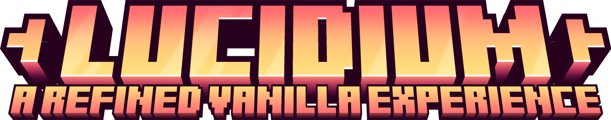
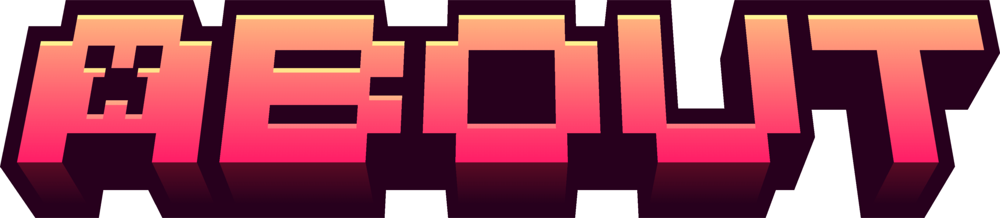
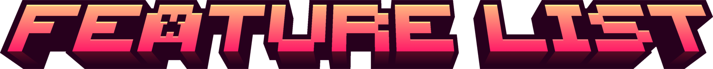
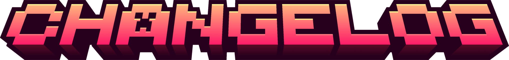
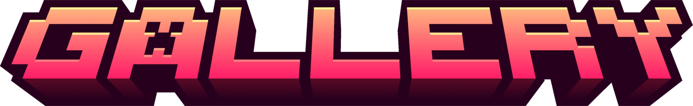
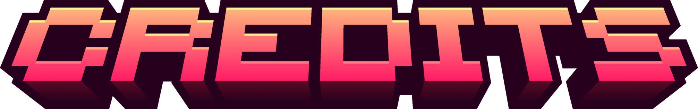
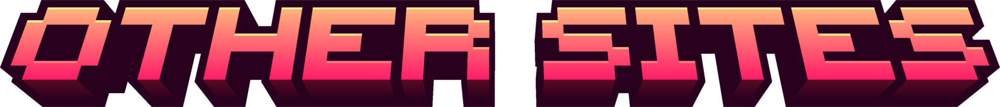
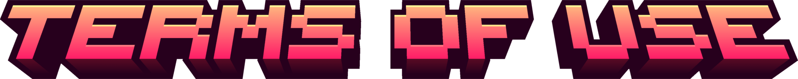

Lucidium is a vanilla-like resource pack of tweaked assets, improvements to outdated textures, simplicity changes and parity fixes with the mission of maintaining the core feeling of the game throughout. With a focus on streamlining redstone design, the pack introduces new blockstate textures for various components, making complex contraptions simpler to create. Outdated textures have been refined, and inconsistencies have been addressed to ensure a cohesive and visually pleasing experience. Most of the default textures have not been altered to ensure that the base feel of the game we all love still shines through the various improvements. Every single change made in this pack, no matter how small, was meticulously toiled over until the perfect aesthetic was achieved. A reasonable amount of the textures, models, and artwork featured in this pack were not made by me; most of the assets that are changed have been heavily edited and curated to ensure consistency with the vanilla Minecraft experience.

> A fully fledged feature list describing everything that is included in the resource pack. All features are organized into categories based on what they change about the game. The list *should* be fully complete, however, if you notice any inconsistencies please raise an issue.

https://github.com/7eventy7/Lucidium/blob/main/FEATURE-LIST.md

> Here is a list of changes and updates made to the Lucidium resource pack. This section documents the evolution of the pack, ensuring that users can track progress and modifications over time.

https://github.com/7eventy7/Lucidium/blob/main/CHANGELOG.md

> Check out individual and in-game comparisons of some of the changes featured in Lucidium.

https://github.com/7eventy7/Lucidium/blob/main/GALLERY.md

> A complete list of all the projects and creators that contributed assets used in Lucidium.

https://github.com/7eventy7/Lucidium/blob/main/CREDITS.md

**PlanetMinecraft**
> https://www.planetminecraft.com/texture-pack/lucidium/

**Modrinth**
> https://modrinth.com/resourcepack/lucidium

**CurseForge**
> https://www.curseforge.com/minecraft/texture-packs/lucidium

[This work is licensed under a Creative Commons Attribution-NonCommercial-ShareAlike 4.0 International.](https://github.com/7eventy7/Lucidium/blob/main/LICENSE.md)

© 2024 7eventy7 | Some Rights Reserved | CC BY-NC-SA 4.0

